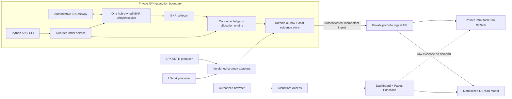
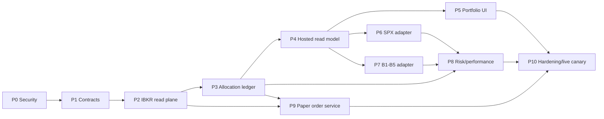

# IBKR Portfolio Hub

## Grand architecture and implementation plan

**Status:** Proposed implementation blueprint
**Prepared:** 2026-08-17
**Primary repository:** `single-stock-investments`
**Scope:** One private application for IBKR positions, Drew/Michael allocations, SPX 0DTE, leveraged-ETF buckets B1-B5, risk, margin, performance, and guarded limit-order entry.

**Baseline note:** This plan reflects the current local worktree. At review time, `single-stock-investments` was dirty and 28 commits behind `origin/main`; begin implementation by establishing a clean, current branch without discarding the existing local changes. The authoritative LS-risk source is the current sibling `ls-algo` repository, not the stale copy under `_external`.

---

## 1. Executive decision

Build the central product in `single-stock-investments`, but do not turn the browser into an IBKR trading client and do not copy the SPX or leveraged-ETF engines into this repository.

The target system has five clear responsibilities:

1. A **private IBKR bridge** running beside the authoritative IB Gateway collects the whole account, reconciles executions, and owns order transmission.
2. A **canonical portfolio ledger** represents every broker position once and allocates it across independent dimensions: owner, strategy, leveraged-ETF bucket, and research theme.
3. **Versioned strategy adapters** ingest SPX 0DTE and leveraged-ETF analytics from their current producer repositories.
4. A **secured hosted read model** powers one dashboard without exposing portfolio data in public static files or gists.
5. A **small Python order interface** creates, previews, approves, submits, and reconciles limit orders through the private bridge, with paper trading and dry-run as the defaults.

This produces the requested navigation:

- **Portfolio**
  - All
  - Drew
  - Michael
- **SPX 0DTE**
- **Leveraged ETFs**
  - Overview
  - B1
  - B2
  - B3
  - B4
  - B5
- **Research**
  - Universe, Market Risk, Short Alpha, Watchlist, Warrants, Insights, Activist, Darwin

The recommended delivery order is read-only broker truth first, strategy integrations second, and live execution last.

---

## 2. What success looks like

At completion, an authorized user can open one application and:

- See every IBKR position, cash balance, option contract, and open order without truncation.
- See account-level Net Liquidation, daily P&L, buying power, initial and maintenance margin, available funds, excess liquidity, cushion, and data freshness as IBKR reports them.
- Move between All, Drew, and Michael without changing the underlying accounting truth.
- Explain every position quantity by owner and strategy, with any unresolved quantity clearly labeled **Unallocated**.
- View SPX 0DTE and B1-B5 as separate strategy products while preserving their connection to the whole account.
- See daily, realized, unrealized, and cumulative performance without silently mixing broker P&L, local model P&L, and cash flows.
- See concentration, factor, beta/delta, option Greeks, stress, borrow, and shared-underlying risks with source and freshness labels.
- Draft and submit a DAY limit order from simple Python only after quote, policy, account, notional, price, and approval checks succeed.
- Trace any number on screen back to a versioned source run and any order back through an immutable event history.

The system is not complete if it merely combines existing HTML panels. It is complete when account facts, allocations, strategy analytics, and execution events reconcile.

---

## 3. Information architecture

### 3.1 Primary navigation

| Route | Purpose | Default scope |
|---|---|---|
| `#/portfolio/all` | Whole-account truth and reconciliation | Broker positions, one row per account/instrument |
| `#/portfolio/drew` | Drew allocation lens | Drew virtual lots and their attributable results |
| `#/portfolio/michael` | Michael allocation lens | Michael virtual lots and their attributable results |
| `#/spx-0dte/overview` | SPX strategy product | SPX live session, positions, risk, execution, performance |
| `#/letf/overview` | Leveraged-ETF aggregate | B1-B5 totals, comparisons, reconciliation |
| `#/letf/b1` through `#/letf/b5` | Individual leveraged-ETF products | Selected bucket only |
| `#/research/universe` | Existing research holdings registry | Research data, not broker holdings |
| `#/research/market-risk` | Existing criticality/market monitor | Market context, not account margin |

The existing `Holdings` label should become `Research` or `Universe`; it currently loads the research registry rather than the IBKR book. The current Drew and Michael top-level routes should redirect to `#/portfolio/drew` and `#/portfolio/michael` for backward compatibility.

### 3.2 Portfolio page layout

Each Portfolio scope uses the same component hierarchy, but the header has two deliberately different layers. The **IBKR account facts** strip remains fixed across All, Drew, and Michael. A separate **selected scope** strip shows allocated equity/cash, gross/net exposure, risk budget, attributable P&L, and model/what-if margin for the chosen owner. Drew/Michael must never display account Net Liquidation, buying power, or broker margin as if those facts were attributable to that owner.

#### Header and account facts

- Net Liquidation
- Daily P&L and daily return
- Cash by currency and base-currency equivalent
- Gross and net exposure
- Buying Power
- Initial Margin Requirement
- Maintenance Margin Requirement
- Available Funds
- Excess Liquidity
- Cushion and leverage
- Open-order count
- Unallocated-position count
- Last broker event, last account-summary update, and last EOD reconciliation

Every value carries a source badge such as `IBKR live`, `IBKR Flex EOD`, `strategy model`, or `estimated`.

#### Main tabs within each Portfolio scope

1. **Positions** — the complete, sortable, filterable position grid.
2. **Risk** — concentration, factors, beta/delta, Greeks, stresses, borrow, and cross-strategy overlap.
3. **Margin & Liquidity** — broker totals, history, buffer alerts, and explicitly labeled allocation estimates.
4. **Performance** — live daily P&L, EOD ledger, NAV, drawdown, attribution, TWR, and cash flows.
5. **Orders** — read-only open/recent order and execution history initially; draft-order creation later.
6. **Reconciliation** — broker-versus-ledger, owner, strategy, execution, cash, and producer-snapshot breaks.

#### Complete positions grid

The All view defaults to one broker row per `account + conId + modelCode`, not one row per ticker. A row can expand to show owner/strategy allocation lots. Filtering to Drew or Michael displays allocated slices without changing account totals.

Required columns:

- Owner, strategy, bucket, and allocation confidence
- Symbol, local symbol, description, security type, currency, exchange
- IBKR `conId`; expiry, strike, right, and multiplier for derivatives
- Quantity, average cost, mark, mark time, and mark quality
- Market value, gross exposure, signed exposure, and percent of NAV
- Daily, unrealized, realized, and cumulative attributed P&L
- Beta, beta-adjusted exposure, delta-equivalent exposure, and available Greeks
- Sector, country, currency, and research theme
- Borrow rate/availability when applicable
- Open-order quantity and status
- Data source, freshness, and reconciliation status

No top-25 truncation is allowed. Large books use pagination or virtualization with server-side sort/filter/export.

### 3.3 Strategy pages

#### SPX 0DTE

Keep the useful specialist workflow:

- Session and connection health
- Halt/flatten status and current configuration
- Open spreads/legs and marked P&L
- Defined-risk, stop-risk, and risk-utilization cards
- Recorded versus live risk history
- Execution-quality and event timeline
- Equity, daily returns, drawdown, and monthly results

The SPX page consumes a versioned SPX producer snapshot. The Portfolio page independently receives the actual SPXW broker positions. A mismatch becomes a visible reconciliation break.

#### Leveraged ETFs

The Overview page compares B1-B5; each bucket has its own deep-linkable subpage. Retain the established taxonomy:

- **B1:** core leveraged exposure
- **B2:** yield-boost exposure
- **B3:** flow/hedge overlay
- **B4:** inverse/decay book
- **B5:** live volatility-ETP accounting sleeve

The existing LS **B5 Product** research stack is a separate UVIX/SVIX-plus-SPX-put research product, not another name for the small live B5 accounting sleeve. Give them separate contracts and labels: `ls_bucket5_live.v1` for broker-reconciling live positions and `ls_bucket5_product.v1` for Overview/Regime/Daily research. The latter is non-reconciling unless it publishes explicit broker-position links.

Each page can show positions, exposure, P&L, return on capital/gross/model margin, concentration, factor exposure, stress, borrow, shared underlyings, product class, and action queue. Reconciliation is basis specific: P&L can include B1-B5, additive book exposure excludes overlay-only rows, and factor-additive totals exclude B3/B5 overlays under the current LS contract. Every exported row therefore needs `reconciliation_role`, `exposure_basis`, and `product_class`; the consumer must never use a bucket label alone to decide whether a row is additive.

---

## 4. Architectural principles

1. **Broker truth is separate from allocation truth.** IBKR says what the account owns; the allocation ledger says who and which strategy own it internally.
2. **Represent a broker position once.** Owner and strategy views are slices, not copied positions.
3. **Owner and strategy are orthogonal.** `owner=drew` does not imply `strategy=single_stock`; an owner can hold SPX or leveraged-ETF allocations.
4. **Unknown attribution fails visibly.** The default is `unallocated`, never an implicit fallback to Michael or Drew.
5. **Actual, attributed, and estimated values are labeled.** Account margin is broker-reported; sleeve margin is a model or incremental what-if, not an additive broker fact.
6. **Read and command planes are separate.** The hosted dashboard reads normalized data; only the private bridge can transmit to IBKR.
7. **Strategy repositories remain producers.** They publish versioned artifacts; this repository does not import their runtime internals or maintain copied engines.
8. **Events are immutable; current state is derived.** Orders, executions, commissions, cash flows, overrides, and restatements are append-only or fully audited.
9. **Every payload is versioned and traceable.** It includes `schema_version`, `source_run_id`, `as_of`, freshness, quality, and content hash.
10. **Security is a Phase 0 dependency.** Sensitive data does not wait for the UI redesign to become private.

---

## 5. Source-of-truth map

| Domain | Authoritative source | Secondary/reconciliation source | Never treat as authority |
|---|---|---|---|
| Account positions | Live IBKR positions, keyed by `conId` | Flex Open Positions at EOD | Research `core.json`; ticker-only sleeve rows |
| Account margin/liquidity | IBKR account values/account summary | Historical account snapshots | Gross-exposure formulas; screened maintenance rates |
| Intraday P&L | IBKR account and position P&L feeds | Local marks with quality labels | SPX event reconstruction for the whole account |
| Completed-session P&L | Flex/accounting ledger with immutable session lineage | Broker snapshots and execution ledger | Mutable browser totals |
| Orders and status | IBKR order callbacks/open orders, persisted locally | Order audit and Flex | A browser `submitted` message |
| Executions/commissions | IBKR execution and commission events | Flex trades at EOD | User-entered fills |
| Owner allocation | Versioned allocation lots and overrides | Positive `orderRef`, historical bootstrap mapping | Ticker heuristic or one machine's local tag file |
| Strategy/bucket allocation | Strategy producer IDs plus allocation ledger | Versioned classification artifact | Stale copied blacklist/universe files |
| SPX analytics | `spx-0dte` versioned export | Broker positions and executions | Public gist; general portfolio formulas |
| Leveraged-ETF analytics | Current `ls-algo` versioned risk export | Broker positions/Flex accounting | Stale `_external/ls-algo` clone |
| Research metadata | `single-stock-investments` research system | Published LETF research metadata | Broker account feed |

---

## 6. Target system architecture



### 6.1 Private IBKR bridge

Run one long-lived, hub-owned bridge beside the authoritative Gateway rather than opening a competing laptop TWS session. Collector and order service are separate application modules, but central order placement and recovery go through this one owned bridge/session rather than competing sockets. Before Phase 2, approve an IBKR client/order-ownership decision record covering:

- Exact client-ID registry for the hub, SPX, LS-risk, and manual TWS activity
- Which client, if any, is Master/client 0 and how observed order IDs advance the allocator
- A durable monotonic order-ID allocator scoped to Gateway session/client identity
- Same-client-ID restart and owned working-order recovery
- Visibility of manual/foreign orders without binding, modifying, or cancelling them
- Persisted `gateway_session_id`, `clientId`, `orderId`, `permId`, `orderRef`, `parentId`, `ocaGroup`, account, and producer
- A categorical ban on account-wide/global cancel from the hub

Do not rely on IB Gateway's Read Only API setting as the collector safety boundary if it prevents required order visibility. Collection-only behavior is enforced in application capabilities, credentials/configuration, and tests; only the owned command module can call order transmission.

The collector subscribes to or periodically obtains:

- Account and model positions
- Account values and account summary
- Account and per-position P&L
- Open/completed order state
- Executions and commissions
- Market data needed for marks and option Greeks
- Connection health and IBKR error events

Snapshot-like feeds carry a subscription/session epoch and their IBKR completion marker, such as the corresponding position/open-order end event. Empty data before a completion marker, after restart, or after an account-permission error means **unknown/incomplete**, never a flat book. Account values are keyed by tag, currency, segment, and model where applicable.

Keep separately named source series for account/portfolio callbacks, account P&L subscriptions, per-position P&L subscriptions, and Flex/EOD results. Each series records account/model, currency, reset schedule/time zone, as-of time, epoch, completeness, and source because these IBKR feeds can legitimately differ.

The bridge persists all callbacks before publishing them. Events include `gateway_session_id`, local receive sequence, broker/source timestamp, source client, source sequence when available, schema version, and idempotency key. Reducers define which fields are commutative and which require ordered/terminal precedence. A durable outbox retries uploads by business-event ID, not merely by a fresh request nonce. Nightly Flex ingestion closes gaps, captures completed-session truth, and records restatements without overwriting prior published sessions.

### 6.2 Canonical ledger and allocation engine

The canonical ledger is the internal accounting boundary. Use SQLite in WAL mode on the NY4 host for v1, with schema migrations, transactional event-plus-outbox commits, encrypted/controlled backups, integrity checks, and a tested restore procedure. Move to Postgres only if multi-host writers or scale require it. Mutable whole-file JSON is not an acceptable ledger or outbox.

The ledger normalizes IBKR signs, multipliers, currencies, identifiers, executions, commissions, and snapshots. It does not replace broker facts with local arithmetic.

The allocation engine maintains virtual lots. Each lot has:

- Account, `conId`, and normalized model ID/model code
- Owner: `drew`, `michael`, or `unallocated`
- Strategy: `single_stock`, `spx_0dte`, `letf`, `cash`, or `other`
- Optional bucket: `b1` through `b5`
- Quantity, cost basis, currency, open time, and source execution
- Originating `orderRef` and immutable execution ID when available
- Effective-dated override history
- Attribution confidence: `confirmed`, `order_ref`, `legacy_bootstrap`, or `unresolved`

There is no implicit third “shared” owner in v1. An economically shared position is represented by explicit Drew and Michael allocation lots whose quantities/weights sum to the broker row. An amount that cannot yet be split remains `unallocated` and appears only in All.

Hard invariant:

```text
sum(all open allocation-lot quantities for account + conId + modelCode)
    == current IBKR broker quantity for account + conId + modelCode
```

The same reconciliation applies to allocated execution quantity, commission, cash flow, and attributable P&L within documented tolerances. IBKR represents combo positions as legs, so the SPX adapter maps producer spread/tranche IDs to execution IDs, leg `conId` values, ratios, and model code; it never infers spread ownership from symbol/expiry alone. A failure is a first-class break; the application does not hide the residual.

### 6.3 Strategy producer adapters

Each specialist repository owns its calculations and publishes a signed or checksummed snapshot into a documented contract. Adapters validate and normalize the envelope without reimplementing the strategy.

Every strategy snapshot must contain:

- Producer and schema version
- Strategy session/trading date
- `generated_at` and source-data as-of times
- Source run ID and content hash
- Account/model identifier where relevant
- Positions or position references using `conId` whenever possible
- Metrics, units, calculation version, and quality status
- Reconciliation totals needed to compare with the broker book
- Atomic leg/contribution rows keyed by a stable producer position ID and `conId` when known
- `reconciliation_role`, `exposure_basis`, `product_class`, and explicitly supported aggregation scopes
- Denominator lineage for every percentage: kind, value, currency, as-of time, and source
- Value provenance such as `broker_reported`, `model_estimate`, or `ibkr_what_if_incremental`

Atomic rows must reaggregate to producer headlines. Nonlinear factor/scenario metrics declare `supported_scopes`; the hub must not pro-rate a whole-strategy result across Drew/Michael. Dollar P&L and exposure travel as canonical values, and percentages are rebased to central account NAV only when their denominator lineage makes that valid.

If a producer is stale or fails reconciliation, its panels remain visible but show a warning and the last valid timestamp. Broker positions remain available independently.

### 6.4 Hosted read model

Use the existing Cloudflare footprint pragmatically:

- **D1:** normalized current/history tables optimized for dashboard reads.
- **Private object storage:** immutable raw payloads, Flex evidence, and signed snapshot bundles. Provision R2 or an equivalent archive before private ingest begins.
- **Pages Functions or a Worker:** authenticated ingest, validation, and read APIs.
- **Cloudflare Access:** user authentication and edge policy, with token validation at the API origin.

D1 is a read model, not the only copy of broker or audit evidence. Provision private R2 or an equivalent immutable archive as a required dependency, not an optional enhancement. Raw source artifacts and the local ledger remain recoverable if the hosted database must be rebuilt.

### 6.5 Read API

Create `/api/v2`. Phase 0 immediately removes the public v1 payload and static fallback. `/api/v1/sleeves` may remain temporarily only as an Access- and origin-authenticated compatibility facade over private data; Phase 10 removes that now-private legacy code and schema.

Suggested endpoints:

```text
GET  /api/v2/portfolio/summary?scope=account|owner|strategy|bucket&id=...
GET  /api/v2/portfolio/positions?scope=...&cursor=...&sort=...&filter=...
GET  /api/v2/portfolio/risk?scope=...
GET  /api/v2/portfolio/margin?scope=...
GET  /api/v2/portfolio/performance?scope=...&period=...
GET  /api/v2/portfolio/orders?status=...&since=...
GET  /api/v2/portfolio/reconciliation?status=open
GET  /api/v2/system/health

POST /api/v2/ingest/account-snapshot
POST /api/v2/ingest/broker-events
POST /api/v2/ingest/strategy-snapshot
POST /api/v2/ingest/eod-reconciliation
```

All responses use a common envelope:

```json
{
  "schema_version": "portfolio.summary.v1",
  "generated_at": "...",
  "as_of": "...",
  "source_run_id": "...",
  "scope": {"type": "owner", "id": "drew"},
  "freshness": {"status": "live", "age_seconds": 4},
  "quality": {"status": "ok", "open_breaks": 0},
  "data": {}
}
```

No hosted endpoint transmits directly to IBKR in the first production release.

---

## 7. Canonical data model

### 7.1 Core identity and evidence

| Table/entity | Purpose | Key identity |
|---|---|---|
| `accounts` | Account metadata, base currency, environment | Internal account ID; encrypted/pseudonymous broker reference |
| `instruments` | Qualified IB contracts | `conId`, security type, local symbol, derivative terms |
| `source_runs` | Lineage for every ingest/build | Producer + run ID + schema version + hash |
| `raw_artifacts` | Pointer and checksum for immutable evidence | Source run + artifact type |
| `data_quality_events` | Stale, missing, invalid, or mismatched data | Stable break/event ID |

### 7.2 Broker facts

| Table/entity | Purpose | Required details |
|---|---|---|
| `account_snapshots` | Point-in-time account header | Timestamp, trading date, base currency, source status |
| `account_values` | IBKR account tags | Tag, currency/segment, numeric value, source timestamp |
| `position_snapshots` | Whole-account positions | Snapshot ID + account + `conId` + model code |
| `position_pnl_snapshots` | Daily/unrealized/realized position P&L | Account + `conId` + time + source |
| `nav_snapshots` | Account/scope equity history | NAV, cash flow, return fields, source quality |
| `cash_ledger` | Deposits, withdrawals, dividends, interest, borrow, fees | Immutable event ID and effective date |

Do not use `(owner, ticker)` as a position key. It collapses different contracts and cannot represent multiple option expiries, venues, currencies, or shared allocations.

### 7.3 Allocation and strategy

| Table/entity | Purpose |
|---|---|
| `allocation_lots` | Open virtual lots by owner, strategy, and optional bucket |
| `allocation_events` | Append-only opens, closes, transfers, and adjustments |
| `allocation_overrides` | Explicit effective-dated legacy or manual corrections with author/reason |
| `cash_allocation_events` | Multi-currency opening capital, deposits/withdrawals, trade settlement, dividends, interest, borrow, fees, and FX effects by owner/strategy |
| `cash_allocation_balances` | Derived owner/strategy cash balances reconciled to broker cash by currency and watermark |
| `strategy_snapshots` | Validated producer snapshots and health |
| `strategy_position_links` | Producer position IDs mapped to broker `conId`/allocation lots |
| `research_metadata` | Sector, country, theme, thesis, conviction, notes |

`research_theme` remains separate from owner/strategy allocation so the existing use of “investment sleeves” for sector/theme classification does not corrupt portfolio accounting.

Owner performance requires cash ownership as well as security lots. Define selected-scope allocated equity as allocated multi-currency cash plus the signed marked value of its allocation lots, converted with a timestamped FX source. Trade settlement, commissions, dividends, interest, borrow, and external flows post through the same owner/strategy dimensions. Owner cash balances reconcile to broker cash at a coherent snapshot watermark; buying power and broker margin remain account-level facts and are not allocated.

### 7.4 Orders and executions

| Table/entity | Purpose | Idempotency identity |
|---|---|---|
| `order_intents` | User request and policy context | Client-generated UUID/idempotency key |
| `order_previews` | Quote, what-if, and validation result | Intent ID + preview version |
| `broker_orders` | IB order identity and current derived state | Pre-ack: Gateway session + client ID + local order ID; post-ack: account + permanent ID |
| `order_events` | Submitted, acknowledged, partial, cancel, reject events | Broker event identity/hash |
| `executions` | Immutable fills | Account + IBKR `execId` |
| `commissions` | Commission/currency/report event | Execution ID + report version |

`intent_uuid`, `(gateway_session_id, clientId, orderId)`, `(account, permId)`, and `(account, execId)` are distinct identities and must never be collapsed into one “order ID.” Cash flows are derived from idempotent executions and broker cash events. Repeating an ingest with a new authentication nonce must not append a duplicate cash flow.

### 7.5 Snapshot and restatement semantics

- Never destructively replace a prior completed-session snapshot.
- Store both `first_published_at` and `last_reconciled_at`.
- A restatement points to the superseded run and records field-level reasons.
- “Latest” is a view over immutable history, not the only stored record.
- Every dashboard total must be reproducible from a source run or declared as live/ephemeral.

---

## 8. Portfolio calculations and labeling

### 8.1 Margin and liquidity

At account level, display IBKR facts:

- NetLiquidation
- GrossPositionValue
- InitMarginReq and MaintMarginReq
- AvailableFunds and ExcessLiquidity
- BuyingPower, SMA, Cushion, and leverage where available
- Look-ahead variants where available and useful

Portfolio-margin requirements are nonlinear and are not safely additive by owner or strategy. Therefore:

- Account totals are labeled **Broker reported**.
- Historical account totals are labeled with their snapshot time.
- Per-sleeve “margin” is labeled **Model estimate** or **Incremental IBKR what-if**.
- Risk-budget usage and gross/net capital are presented separately from margin.
- A proposed order's what-if result is a point-in-time incremental estimate, not a permanent sleeve allocation.
- What-if requests are user initiated, throttled, cached briefly, and never run continuously across every position.

This provenance is enforced in the schema, not only in presentation. Every margin-like value has `value_kind = broker_reported | model_estimate | ibkr_what_if_incremental`, source, as-of time, currency, and model version where relevant. Aggregators reject any attempt to sum model or what-if values into broker account margin. Owner pages show account margin context alongside owner risk/capital estimates; they do not fabricate allocated broker margin.

### 8.2 P&L and performance

Maintain three explicitly separate series:

1. **Broker P&L:** IBKR daily, realized, and unrealized values.
2. **Attributed P&L:** execution/cost/commission-aware allocation of broker results to owner and strategy.
3. **Model P&L:** strategy-specific analytical or reconstructed results.

Performance outputs:

- Live daily P&L and percent of start-of-day NAV
- Daily EOD P&L, weekly/monthly/YTD totals
- Realized versus unrealized P&L
- Dividends, interest, borrow, commissions, and other carry
- NAV/equity curve and drawdown
- Time-weighted return adjusted for external cash flows
- Optional money-weighted/XIRR view when cash-flow history is sufficiently complete
- Attribution by owner, strategy, bucket, name, sector, and factor

Historical results before the allocation-ledger start date must be labeled `legacy/inferred` unless execution-level ownership is reconstructed and reviewed.

For the LS producer specifically, do not map legacy `pnl_today_*` aliases to daily P&L; those fields can represent cumulative/YTD values. The adapter contract must carry separate `session_pnl`, `cumulative_pnl`, and `restatement` fields. Completed-session date comes from Flex statement lineage rather than the web server's wall clock, and the existing B5 carry/headline accounting parity must remain producer-tested.

### 8.3 Risk

Deliver risk in layers so the read-only portfolio is not blocked on a perfect risk engine.

**Layer 1 — exposure and concentration**

- Gross/net/long/short by owner, strategy, sector, currency, and security type
- Single-name and underlying concentration
- Shared underlyings across single-stock, SPX, and LETF products
- Beta and delta-equivalent exposure
- Option delta/gamma/vega/theta when marks support them
- Short exposure, borrow rate/availability, and carry

**Layer 2 — factor and covariance**

- Market and multi-factor betas
- Contribution to variance
- Correlation and diversification
- Leveraged-ETF underlying normalization and overlay handling

**Layer 3 — scenarios**

- SPX and VIX shocks
- Historical and path-dependent stress
- Borrow and short squeeze stress
- Volatility ETP and leveraged-product slide/decay stress
- Custom account-wide shocks

Every calculated metric includes model version, market-data time, coverage, and quality. Missing Greeks or factor data reduce coverage; they do not silently become zero.

---

## 9. What to reuse, adapt, and leave behind

### 9.1 `single-stock-investments`

| Decision | Existing component | Use in the new system |
|---|---|---|
| **Port behavior/tests** | `_system/trading/sleeves/ib_client.py` | Connection, explicit account pin, contract qualification, live quotes, position request, and limit-order requirements; reimplement behind the selected maintained IB API adapter |
| **Port behavior/tests** | `orders.py`, `safeties.py`, `send.py`, `desk.py` | Proposal/approval workflow, dry-run default, quote freshness, price bands, caps, cooldown, kill file, and account guard; they are not the required callback-driven state machine as-is |
| **Reference only** | `store.py` | Preserve useful behaviors/fixtures, but replace mutable whole-file JSON with transactional SQLite/WAL ledger and outbox |
| **Reuse** | Flex parsing and live/Flex overlay | Seed for EOD reconciliation, not intraday authority |
| **Visual reference** | `sleeve-viz.js` | Position-card/table and research-note interaction patterns only; remove owner-specific fetch/static-fallback assumptions |
| **Reuse** | HMAC timestamp/nonce/replay checks in Pages Functions | Machine-ingest authentication foundation; add business-event idempotency |
| **Adapt** | `sync_ib.py` and `classify_positions.py` | Expand to all positions and default unresolved ownership to `unallocated` |
| **Adapt** | D1 and `/api/v1/sleeves` | Replace hard-coded owner/ticker model with versioned `/api/v2` contracts |
| **Retire** | Public `sleeves_*.json` account snapshots | Sensitive portfolio data must not be deployed as a static asset |
| **Retire** | Synthetic NAV/cash/buying-power formulas in `book.py` | Replace with broker account values and explicit performance accounting |
| **Retire** | Local tag file as sole ownership authority | Migrate to central, audited, effective-dated allocation records |

Important current-state references:

- Navigation and flat Drew/Michael routes: `dashboard/index.html:1646-1656`, `2138-2165`, `3257-3291`
- Existing sleeve schema: `dashboard/cloudflare/migrations/0007_sleeves.sql`
- Existing Pages Functions: `dashboard/functions/api/v1/sleeves/`
- Existing suite: `_system/trading/sleeves/tests/` (31 tests currently pass locally)

### 9.2 Current LS-risk system

Use the current sibling repository at `C:\Users\drewg\Projects\quant\ls-algo`; do not build against the stale `_external/ls-algo` copy.

| Decision | Existing component | Use in the new system |
|---|---|---|
| **Reuse contract** | `risk_dashboard/DATA_CONTRACT.md` | Completed-session lineage, immutable P&L/restatements, source authorities, and publish gates |
| **Reuse calculations** | `risk_dashboard/metrics.py` | Book summaries, B1-B5 taxonomy, exposure/P&L rows, sleeve metrics, concentration, factor, borrow, data quality |
| **Reuse engines** | `scenario_engine.py`, `spx_scenario.py`, `vix_scenario.py`, `borrow_stress.py`, `variance_decomp.py`, `beta_loader.py` | Preserve in producer or extract behind a versioned library boundary; do not rewrite in UI |
| **Reuse UI concepts** | `site/index.html`, `site/assets/js/app.js` | Cockpit, P&L/drawdown, factor, stress, concentration, sleeves, bucket, shared-name, and borrow panels |
| **Reuse product pattern** | `site/assets/js/bucket5_product.js` | Overview/Regime/Daily strategy-product navigation pattern |
| **Reuse accounting** | `ibkr_flex.py`, `ibkr_accounting.py` | Completed-session and Flex truth |
| **Reuse execution controls** | `execute_trade_plan.py` | Account validation, limit-order builder, guarded execution, partial-fill/cancel patterns |
| **Reuse gates/tests** | `scripts/dashboard_pipeline.py` and dashboard/accounting contract tests | Snapshot verification, parity, checksum, and deployment gates |
| **Adapt** | Existing per-bucket margin | Keep as a labeled model estimate; add actual account margin from the central collector |
| **Improve** | Existing exposure UI | Replace top-position truncation with the complete shared portfolio grid |

The central app should ingest a minimal allowlisted `ls_risk_snapshot.vN` artifact, not import `metrics.py` at web runtime, copy generated snapshots into this repository, or republish the entire UI-shaped `latest.json`. The export must omit absolute source paths and ambiguous legacy aliases.

LS-specific contract invariants:

- Additive exposure, factor exposure, and P&L use separate reconciliation equations.
- The current additive exposure equation uses B1+B2+B4+unbucketed rows; B3/B5 overlay rows remain separately reported.
- Factor-additive totals exclude B3/B5 overlays; period P&L can reconcile across B1-B5.
- B4 attribution/ratio-split totals and B4 pair-detail totals are two lenses and are never substituted.
- B3 return-on-capital can be intentionally null; carry a `null_reason` instead of inventing a denominator.
- `product_class` is independent of accounting bucket and controls product-specific analytical behavior.
- All percentages preserve producer denominator lineage; a strategy-capital percentage is not labeled as an account-NLV return.
- Live B5 and B5 Product research use separate namespaces and tests.

### 9.3 SPX 0DTE

Use the current sibling repository at `C:\Users\drewg\Projects\options-trading\spx-0dte`.

| Decision | Existing component | Use in the new system |
|---|---|---|
| **Reuse shape** | `live/session_status_server.py` schema-2 status | Session health, halt/flatten, open count, P&L, risk, execution quality, history, events, curated config |
| **Reuse UI concepts** | `docs/index.html` | Health/P&L cards, live-book table, live/recorded risk selector, risk history, equity/drawdown/monthly patterns |
| **Reuse primitives** | `live/account_guards.py`, `ib_connection.py`, `connection_health.py`, `kill_switch.py` | Broker health, reconnect, guard, and kill-switch behavior behind generic interfaces |
| **Adapt** | `live/entry_execution.py` | Extract the non-blocking pending-order, partial-fill, cancel/fill-race state machine; remove SPX dependencies |
| **Adapt** | `scripts/quote_sleeve_margin.py` | Generic user-initiated IBKR what-if preview service |
| **Adapt** | `live/session_recovery.py` | Fail-closed restart/reconciliation pattern, not SPX-only position filtering |
| **Reuse operations** | `deploy/linux/systemd/` | Separate Gateway, collector/executor, status, publisher, watchdog, preflight, and hygiene services |
| **Do not copy** | `live/ib_executor.py` | SPX contract, BAG, signal, stop, tranche, and scheduling logic remains SPX-owned |
| **Do not copy** | SPX-only payoff, strike-ladder, and session-P&L formulas | They do not generalize to whole-account stocks, ETFs, and options |
| **Retire for sensitive data** | Public live-status gist | It is not an acceptable transport for the whole account or order state |

The SPX producer must set a positive order ownership reference for new orders. Exclusion-only conventions are not sufficient for a central execution service.

### 9.4 Leveraged-ETF research dashboard

Treat `C:\Users\drewg\Projects\dashboards\etf-dashboard` as the research/screener producer, not as the live account or risk ledger.

Reuse security metadata, explanatory content, screener context, and deep links through a versioned public/research artifact. Account positions, P&L, borrow, and risk come from IBKR and `ls-algo`. Do not merge public research exports with private account payloads.

---

## 10. Simple Python limit-order interface

### 10.1 Intended user experience

For v1, install and run the Python package on the NY4 bridge host; invoke it through the existing authenticated administrative/SSH path. `from_profile()` selects a local secret-backed account alias and connects to the local hub service, not directly to an arbitrary user's TWS. The bridge records the authenticated OS/caller identity and policy role. A remote mTLS/Zero-Trust RPC can be designed later, but no unauthenticated network command endpoint is part of v1.

The public Python surface should be small while the service remains strict underneath.

```python
from portfolio_hub import PortfolioClient

client = PortfolioClient.from_profile("paper")

contract = client.qualify_one(
    symbol="XYZ",
    security_type="STK",
    currency="USD",
    primary_exchange="NYSE",
)

ticket = client.preview_limit_order(
    owner="drew",
    strategy="single_stock",
    contract=contract,
    side="BUY",
    quantity=100,
    limit_price=12.34,
    tif="DAY",
)

print(ticket.summary())
ticket.submit(confirm=ticket.approval_phrase)
```

Equivalent command-line flow:

```text
python -m portfolio_hub.orders limit \
  --profile paper --owner drew --strategy single_stock \
  --conid QUALIFIED_CONID --side buy --quantity 100 --limit 12.34
```

Symbol lookup must resolve to exactly one reviewed contract; it never silently selects the first match. The preview shows the qualified `conId` and full contract, fresh NBBO, price age, current and post-trade position, gross/notional change, owner/strategy allocation, policy checks, incremental what-if margin when required, warnings, and the idempotency key. The service re-quotes immediately before submission.

The one-shot approval token/phrase is bound to a hash of account, `conId`, action, quantity, limit, TIF, outside-RTH flag, allocation, preview quote, policy version, and expiry. Any change invalidates it.

### 10.2 Order state machine

```mermaid
stateDiagram-v2
    [*] --> Draft
    Draft --> Validated: contract + account + policy pass
    Draft --> Rejected: validation fails
    Validated --> Previewed: fresh quote / policy-directed what-if
    Previewed --> Approved: explicit one-shot approval
    Previewed --> Expired: quote or approval expires
    Approved --> Submitting: persist intent + IDs before placeOrder
    Submitting --> Acknowledged: broker ack/order status
    Submitting --> Rejected: definite broker rejection
    Submitting --> SubmitUncertain: disconnect/timeout after send
    SubmitUncertain --> Reconciling: query owned refs, IDs, orders, executions
    Reconciling --> Acknowledged: owned working order found
    Reconciling --> Filled: execution found
    Reconciling --> ReconciledAbsent: confirmed absent; new intent required
    Acknowledged --> Partial
    Acknowledged --> Filled
    Acknowledged --> CancelPending
    Partial --> Partial
    Partial --> Filled
    Partial --> CancelPending
    CancelPending --> Cancelled
    CancelPending --> Filled: fill/cancel race reconciled
    Rejected --> [*]
    ReconciledAbsent --> [*]
    Cancelled --> [*]
    Filled --> [*]
    Expired --> [*]
```



### 10.3 Mandatory controls

- Paper/read-only/dry-run is the default profile.
- Live trading requires a configured live interlock plus per-order approval; no code default may enable it.
- Account ID is pinned and verified before every submission.
- Each order uses a positive namespace such as `MAGIS|owner|strategy|intent_uuid` in `orderRef` or an equivalent persisted mapping.
- Only qualified contracts and DAY limit orders are enabled in the first release.
- Quote freshness, crossed/invalid quote, limit-versus-NBBO, maximum spread, price-deviation, and contract market-rule tick-size gates fail closed.
- Maximum quantity, order notional, post-trade name exposure, gross exposure, sleeve budget, and daily order-count gates fail closed.
- Options, non-USD instruments, short sales, outside-RTH trading, and exchanges are separately policy controlled; current documentation/config disagreements must be resolved before enabling them.
- Sells default to `reduce_only` and cannot cross through zero without explicit short authority.
- Preview/approval tokens are one-shot and expire quickly.
- Submission is idempotent; an uncertain response triggers reconciliation, not a blind retry.
- Partial fills, cancels, rejections, and fill/cancel races are persisted and displayed.
- A local kill switch blocks new submission while leaving reconciliation active.
- The service only cancels orders it positively owns by account/client/order reference. Manual, SPX, LS, and other foreign orders can be observed but are never bound or cancelled.
- Global/account-wide cancel is forbidden.
- Every decision records inputs, policy version, quote, user, time, result, and broker IDs.

IBKR what-if preview uses a distinct throwaway order object and order ID with the API-required what-if/transmit settings; the object and ID are never mutated or reused for real submission. The service persists the returned margin/commission estimate and time, re-runs policy afterward, and asserts through integration tests that no live order appeared. What-if is mandatory for opening shorts, opening/increasing option risk, and configurable high-notional/high-risk orders; it can remain optional for low-risk reduce-only activity. Requests are throttled in line with IBKR guidance.

### 10.4 What stays out of the browser

The browser never receives IBKR credentials, connects to TWS/Gateway, or calls `placeOrder`. Initial production order entry is local Python only. A later UI may create a signed order **draft** that the private bridge pulls and revalidates, but it still cannot directly transmit.

---

## 11. Security and privacy architecture

### Phase 0 controls

1. Put the entire existing Pages application and every API behind Cloudflare Access for the initial release. This is the safest topology for the current single build target.
2. Validate the Access token at the application/API boundary; client-side UI hiding is not authorization.
3. Protect or disable preview deployments and direct-origin paths that bypass the intended hostname.
4. Remove live account positions from committed/deployed static JSON immediately and disable the browser fallback. For the existing SPX monitor, first dual-publish to the private replacement and verify parity, then redact/disable the public gist position payload without creating a monitoring gap.
5. Require authenticated machine ingest using a service token or HMAC with timestamp, nonce, replay rejection, payload hash, and business-event idempotency.
6. Pass required ingest secrets explicitly through the deployment workflow and fail deployment if they are absent.
7. Store IBKR credentials only on the private execution host. Store hosted secrets only as platform secrets, never in browser JavaScript, JSON, logs, or Git.
8. Move hard-coded broker account/client mappings to environment- or secret-backed aliases; scrub public docs, generated UI text, and fixtures; redact identifiers in logs and pseudonymize them in the hosted read model where practical.
9. Define roles: `viewer`, `trader`, and `admin`. Viewing portfolio data does not imply order authority.
10. Retain immutable order/audit evidence privately with controlled export and retention.

Initial boundary:

- Lock the whole current Pages application and its `pages.dev`/preview/direct-origin variants.
- Use a deny-by-default deployment manifest rather than copying most of `dashboard/` and making `/data/*` broadly cacheable.
- No account payload flows to the public `etf-dashboard` bundle.

If public research must remain available later, create a second explicit build target and hostname with an allowlisted file manifest. Private and public builds have independent deployment tests; no shared catch-all copy step is allowed.

Required automated security tests:

- Unauthenticated requests to all `/api/v2/portfolio/*` endpoints are denied.
- Unauthenticated direct requests to sensitive data objects are denied.
- No built static artifact contains a live position/account snapshot.
- The public-build allowlist, if enabled, rejects any unclassified file and all broker-account identifier patterns.
- Replayed HMAC nonce is rejected.
- Replayed broker business event with a new nonce is idempotent.
- Viewer cannot create an order draft; trader cannot change policy; browser cannot submit to IBKR.

---

## 12. Proposed repository layout

Implement incrementally without making a front-end framework migration a prerequisite.

```text
single-stock-investments/
  contracts/
    portfolio/
      account_snapshot.v1.schema.json
      broker_events.v1.schema.json
      allocation_ledger.v1.schema.json
      portfolio_read.v1.schema.json
      spx_snapshot.v1.schema.json
      ls_risk_snapshot.v1.schema.json
  _system/trading/portfolio_hub/
    migrations/
    config/
    ibkr/
      connection.py
      collector.py
      account_values.py
      orders.py
      executions.py
    ledger/
      database.py
      models.py
      normalize.py
      accounting.py
      reconciliation.py
    allocation/
      lots.py
      bootstrap.py
      overrides.py
    risk/
      aggregation.py
      coverage.py
    orders/
      intent.py
      policy.py
      preview.py
      service.py
      state_machine.py
    adapters/
      spx.py
      ls_risk.py
    publish/
      outbox.py
      client.py
    cli/
    tests/
  dashboard/
    portfolio-viz.js
    spx-0dte-viz.js
    letf-viz.js
    functions/api/v2/
    cloudflare/migrations/0008_portfolio_v2.sql
  scripts/
    verify_portfolio_contracts.py
    verify_private_boundary.py
    reconcile_portfolio.py
```

The current `_system/trading/sleeves` remains operational during migration. Reusable code should move behind tests into `portfolio_hub`; do not fork two independent execution stacks.

---

## 13. Full implementation plan

Effort estimates below are engineering effort, not calendar promises. The critical read-only path is Phase 0 through Phase 5. SPX and LS-risk adapters can then proceed in parallel. Live execution stays behind the final gates.

### Phase 0 — Security, policy, and baseline

**Estimated effort:** 1-1.5 engineering weeks
**Goal:** Make it safe to ingest richer account data and freeze ambiguous policy.

Work:

- Inventory every current portfolio/static/gist/API exposure.
- Lock the entire existing Pages application behind Cloudflare Access, add server-side token validation, and protect preview/direct-origin variants.
- Delete public live sleeve JSON payloads and disable public fallback behavior; any temporary v1 endpoint becomes private immediately.
- Add private-boundary manifest/check patterned after `ls-algo`.
- Fix deployment-secret wiring for machine ingest.
- Replace hard-coded live account/client identifiers in config, scripts, docs, generated text, and fixtures with secret-backed aliases; add CI scanning for broker account patterns.
- Provision private R2 or an equivalent immutable archive and define its access/retention boundary.
- Approve the IB Gateway/client/order-ownership ADR: Master/observer behavior, central bridge client, monotonic ID allocation, same-client recovery, and foreign-order visibility without cancel authority.
- Deploy positive order-reference ownership in SPX and LS producers before hub order reconciliation. Classify existing working strategy/manual orders conservatively as foreign/legacy and forbid hub cancellation; never use global cancel.
- Resolve options, CAD/TSE, short-sale, and outside-RTH policy contradictions.
- Freeze vocabulary: owner, strategy, bucket, research theme, account, and model.
- Capture golden current-account fixtures with identifiers redacted for tests.

Acceptance:

- Anonymous API/static fetch cannot retrieve live positions.
- CI proves no sensitive account artifact enters a public bundle.
- Trading policy and client/order ownership registry are reviewed.
- Public artifacts and fixtures contain no live broker account identifier.
- All working orders are positively owned or visibly foreign/unresolved; the hub has zero cancel authority over foreign orders.
- Existing sleeve tests remain green.

### Phase 1 — Canonical contracts and schema

**Estimated effort:** 1.5-2 engineering weeks
**Goal:** Establish one data language before adding UI or integrations.

Work:

- Write JSON Schemas for account snapshots, broker events, allocation ledger, strategy snapshots, and read responses.
- Define `conId`-based position and `execId`-based execution identities.
- Define units, signs, multipliers, currencies, timestamps, source precedence, and null/missing semantics.
- Define freshness states: live, delayed, EOD, stale, invalid.
- Define immutable-session and restatement behavior.
- Select the maintained IB API adapter and document which existing behaviors/tests are being ported.
- Finalize SQLite/WAL local ledger, transactional outbox, migration, encryption/backup, and restore design; design D1 v2 migrations separately.
- Define the multi-currency owner/strategy cash subledger and selected-scope allocated-equity/NAV formula.
- Decide cutover opening basis, tax/accounting lot method, Decimal precision, corporate-action treatment, FX source, and when pre-cutover performance is suppressed versus labeled inferred.
- Create a source/entitlement matrix for live marks, Greeks, factors, historical prices, FX, borrow, corporate actions, and trading calendars, including timestamps and internal-display rights.
- Define immutable business-event retention separately from sampled/coalesced quote/P&L telemetry, publish cadence, hosted retention, and browser polling/SSE behavior.
- Create canonical golden fixtures: long/short stock, multiple option expiries, same `conId` in different models, FX/cash allocation, partial fill, same instrument split between Drew/Michael, multi-leg combo partial fill, SPX, each B1-B5 bucket, cash flow, restatement, strategy-capital/account-NLV denominator mismatch, B4 attribution versus pair detail, and distinct live-B5/product-B5 records.
- Add contract producers/consumers tests in all three repositories.

Acceptance:

- The same fixture validates in Python, Pages Functions, and browser DTO parsing.
- A ticker collision cannot collapse distinct contracts.
- Unknown owner/strategy remains unallocated and produces a break.
- Schema-version incompatibility fails loudly.
- An LS percentage cannot be consumed without denominator lineage, and unsupported owner-scoped nonlinear metrics remain unavailable rather than being pro-rated.
- Ledger event and outbox commit is atomic, and a backup restores to the same ledger/outbox state.

### Phase 2 — Whole-account IBKR read plane

**Estimated effort:** 2-3 engineering weeks
**Goal:** Collect the actual account continuously and recoverably.

Work:

- Port tested IB connection and health behaviors behind the selected central adapter.
- Add full account values: NetLiquidation, GrossPositionValue, cash/currency, Init/Maint Margin, AvailableFunds, ExcessLiquidity, BuyingPower, SMA, Cushion, leverage, and useful look-ahead fields.
- Subscribe to all positions and account/position P&L with session epochs, completion markers, account/model/currency/reset metadata, and permission-error handling.
- Persist contract details, marks, option Greeks, open orders, order status, executions, and commissions.
- Build the SQLite/WAL event store and transactional outbox with idempotent retry; persist immutable business events while sampling/coalescing high-frequency telemetry.
- Add startup reconciliation before declaring healthy.
- Provision secure Flex query retrieval and add parsers/contracts for positions, trades, commissions, cash transactions, dividends, interest, borrow, corporate actions, and statement NAV; handle query lag and restatements.
- Emit bridge health, last-event timestamps, source errors, and coverage.

Acceptance:

- Every TWS portfolio row maps to one canonical broker position.
- Account summary values match IBKR within timestamp/rounding tolerances.
- Restart recovers current positions/orders and does not duplicate executions or cash flows.
- Restart mid-snapshot, permission-denied/missing-account, multi-currency, multiple-model, and empty-before-end-marker fixtures remain incomplete/unknown rather than appearing flat.
- TWS manual, SPX, LS, and hub-owned orders are all visible; only hub-owned orders are recoverable/cancellable by the hub, and no foreign cancel occurs.
- Disconnect/reconnect and stale-data states are visible.
- EOD Flex reconciliation records breaks/restatements rather than overwriting history.

### Phase 3 — Allocation ledger and historical bootstrap

**Estimated effort:** 1.5 engineering weeks
**Goal:** Make Drew/Michael and strategy ownership durable and auditable.

Work:

- Implement virtual allocation lots and effective-dated overrides.
- Implement multi-currency cash-allocation events/balances for opening capital, settlement, external flows, income, borrow, fees, and FX.
- Define positive order-reference namespace for all new central orders.
- Import existing sleeve tags only as bootstrap suggestions.
- Generate a review file/UI showing every current position, proposed owner, strategy, bucket, evidence, and confidence.
- Require explicit approval for legacy allocation baseline.
- Default ambiguous residuals to `unallocated`.
- Track allocation transfers as events rather than rewriting history.
- Reconcile Decimal quantity/cost/commission/P&L by broker position and execution at a coherent source watermark, with explicit tolerances for currency rounding and callback lag.

Acceptance:

- All allocation quantities sum to broker quantities at the same completed watermark or have an open severity-one break; an in-progress callback epoch cannot create a false flat/residual alert.
- Allocated cash reconciles by currency and watermark to broker cash or leaves an explicit unallocated residual.
- No position defaults silently to Michael or Drew.
- Losing the original laptop tag file cannot change ownership.
- Every manual correction shows actor, time, reason, before, and after.

### Phase 4 — Private hosted read platform

**Estimated effort:** 1.5 engineering weeks
**Goal:** Publish validated portfolio state without exposing the command plane.

Work:

- Add D1 v2 schema and migrations.
- Add the required private raw-object archive and checksummed source-run manifest.
- Implement authenticated/idempotent account, event, strategy, and EOD ingest.
- Build normalized `/api/v2` read endpoints with scope, pagination, filter, and freshness.
- Batch/coalesce telemetry uploads and define browser refresh by polling or SSE; do not persist every quote/P&L tick indefinitely in D1.
- Add read-side derived summaries while preserving source facts.
- Add retention, backup/export, and rebuild-from-evidence procedure.
- Add API authorization and direct-origin tests.

Acceptance:

- Hosted current state rebuilds from raw evidence.
- Duplicate uploads are idempotent; realistic out-of-order callbacks resolve according to the documented receive/session ordering and terminal-state precedence.
- API totals equal the local canonical ledger for golden and current snapshots.
- Anonymous access is denied at edge and application layers.

### Phase 5 — Portfolio All, Drew, and Michael UI

**Estimated effort:** 2 engineering weeks
**Goal:** Deliver the first complete, useful, read-only central portfolio.

Work:

- Add new routes and redirect existing Drew/Michael links.
- Rename existing Holdings/Risk sections to clarify research versus account risk.
- Build account-facts header with source/freshness badges.
- Build a separate selected-scope strip for allocated equity/cash, exposure, attributable P&L, risk budget, and modeled/what-if measures.
- Build virtualized all-positions grid with saved filters and CSV export.
- Add expandable allocation-lot detail.
- Add Drew/Michael overview cards, positions, thesis/notes, allocation confidence, and performance coverage.
- Add account margin/liquidity history and reconciliation panel.
- Add order/execution history as read-only.
- Add empty, stale, delayed, error, and partial-coverage states.

Acceptance:

- All IBKR positions are visible and searchable.
- Portfolio All totals use broker rows and do not double-count allocation slices.
- Drew + Michael + unallocated reconcile to the account; intentionally shared economics are explicit Drew/Michael lots rather than a hidden third owner.
- No account-level fact is sourced from the old synthetic book formula.
- Any stale or unreconciled source is conspicuous.

**First major release:** This phase is the read-only Portfolio Hub MVP.

### Phase 6 — SPX 0DTE adapter and page

**Estimated effort:** 1 engineering week
**Goal:** Bring SPX visibility into the hub without transplanting its executor.

Work:

- Add a versioned export builder in `spx-0dte`.
- Dual-publish to the private ingest path, compare health/payload parity, then redact/disable the public-gist position dependency with rollback available.
- Validate/ingest session health, risk, positions, P&L, execution quality, events, and performance.
- Build the SPX page using established UI concepts.
- Map SPX spread/tranche IDs to execution IDs and broker leg `conId`/ratio/model records; reconcile producer positions and P&L to leg-level broker positions/executions.
- Deep-link to the specialist dashboard for advanced diagnostics if retained.

Acceptance:

- SPX page remains useful if the strategy exporter is stale, with warning.
- Broker/SPX mismatches create explicit breaks.
- Multi-leg and partial-fill fixtures reconcile by execution and leg; symbol/expiry inference alone is rejected.
- No SPX-only order or payoff logic is duplicated into the central order service.

### Phase 7 — Leveraged-ETF B1-B5 adapters and pages

**Estimated effort:** 1.5 engineering weeks
**Goal:** Centralize B1-B5 visibility while retaining LS-risk authority.

Work:

- Add/version the LS-risk published snapshot contract.
- Export and ingest allowlisted atomic contribution rows plus book, bucket, exposure/P&L, concentration, factor, borrow, stress, data-quality, and action-queue headlines.
- Build Leveraged ETFs Overview plus B1-B5 deep-linkable pages.
- Replace truncated exposure tables with the shared all-position component.
- Reconcile broker positions and Flex/accounting totals using basis-specific equations.
- Ingest public research metadata separately from private risk/account payloads.

Acceptance:

- B1-B5 are independently filterable; every row declares its reconciliation role, exposure basis, and product class.
- Broker quantities linked to LETF allocations reconcile by account and `conId`; unresolved residual is visible.
- Additive LS exposure reconciles using B1+B2+B4+unbucketed rows under the current contract; B3/B5 overlays remain separately reported.
- Factor-additive totals exclude B3/B5, while period P&L reconciles across B1-B5 within the producer tolerance.
- B4 attribution totals and pair-detail totals are both retained and never substituted.
- Live B5 reconciles to broker/Flex; B5 Product research is explicitly non-broker unless a specific live link passes.
- Actual account margin and LS model margin are visibly distinct.
- Central deployment does not depend on the stale `_external/ls-algo` clone.

### Phase 8 — Account-wide risk and performance

**Estimated effort:** 2 engineering weeks
**Goal:** Add trustworthy cross-sleeve analytics.

Work:

- Implement exposure/concentration and shared-underlying aggregation.
- Add beta/delta-equivalent and option-Greek coverage.
- Integrate versioned factor, scenario, VIX/SPX, borrow, and slide-risk results.
- Build broker/attributed/model P&L views.
- Build cash-flow-aware TWR, NAV, drawdown, weekly/monthly/YTD, and attribution.
- Add coverage and model-quality diagnostics.
- Define alert thresholds for liquidity, margin cushion, concentration, stale data, and reconciliation.

Acceptance:

- Risk totals reconcile to canonical exposures.
- Missing model inputs are excluded with coverage shown, never coerced to zero.
- Returns handle deposits/withdrawals without counting them as investment P&L.
- EOD headlines match completed-session accounting and preserve restatements.

### Phase 9 — Guarded Python order service, paper only

**Estimated effort:** 2 engineering weeks plus paper soak
**Goal:** Prove simple, safe, auditable limit-order behavior without browser-to-IBKR access or live authority.

Work:

- Port safety behaviors/tests from the sleeve, LS, and SPX systems into one callback-driven general order adapter.
- Implement typed `OrderIntent`, exact contract qualification, policy engine, quote/preview, isolated what-if, ticket-bound approval, and uncertain-submit reconciliation.
- Durably persist intent and local broker IDs before `placeOrder`; persist all callbacks afterward.
- Use the one hub-owned bridge/session and distinct intent, local order, permanent order, and execution identities.
- Implement positive order ownership, idempotency, partial-fill/cancel/reject recovery, and no-blind-retry behavior.
- Build the NY4-installed Python package and interactive CLI with authenticated caller audit.
- Reconcile allocations and multi-currency cash events from executions automatically.
- Keep paper/live configuration physically and logically separate; add local kill switch.
- Expose order history in the hosted read plane; keep transmission private.

Acceptance for paper release:

- Unit/integration tests cover every state transition and failure path.
- Duplicate submit cannot create a second broker order.
- Exact approval is bound to account, contract, side, quantity, price, TIF, allocation, quote, policy, and expiry.
- Scenario evidence covers buy, reduce-only sell, prohibited short crossing, reject, partial fill, cancel/fill race, stale quote, Gateway restart with a working order, and disconnect after send/before acknowledgement.
- An uncertain submit remains blocked in reconciliation and can never be blindly retried.
- TWS manual, SPX, and LS orders coexist with zero hub modification/cancellation.
- What-if isolation tests prove that preview creates no live working order.
- Account, order reference, tick size, price, quote age, quantity, notional, gross/name/sleeve limits, and market-hours gates fail closed.
- No live profile can be enabled in this phase.

### Phase 10 — Production hardening, cutover, and live canary

**Estimated effort:** 1.5-2 engineering weeks plus mandatory soak
**Goal:** Make the read hub operationally durable, then enable a tightly capped live-order canary only after all prerequisites pass.

Work:

- Add service supervision, watchdogs, health checks, alerts, log retention, and backups.
- Wire all contract, accounting, private-boundary, API, and browser tests into CI.
- Add daily snapshot verification/checksum/deploy gates.
- Run old/new sleeve views in parallel and compare.
- Retire the already-private `/api/v1/sleeves` compatibility code/schema, old static fallback code, synthetic portfolio totals, and duplicate execution code only after parity.
- Document ownership, incident response, data correction, Gateway restart, and order-disable procedures.
- Require completed SPX/LS positive-ownership migrations, Phase 8 risk budgets, zero unresolved working-order ownership, and zero unresolved order/execution reconciliation.
- Exercise scenario-based paper recovery and at least ten consecutive clean paper sessions as supporting soak evidence.
- Start live with an explicit security/contract allowlist, very small notional and daily-order caps, one-order-at-a-time concurrency, and per-order human approval.

Acceptance:

- One command can validate/rebuild/publish the read model from evidence.
- Recovery drills pass without data loss or duplicate order submission.
- Alerts identify stale collector, stale producer, reconciliation break, margin-buffer breach, and order-service fault.
- Old views redirect cleanly and no sensitive deprecated endpoint remains.
- Gateway restart, disconnect-after-send, partial fill, cancel/fill race, kill switch, and foreign-order coexistence drills pass with zero duplicate orders and zero foreign cancels.
- Backups, restore, process supervision, disable/rollback path, CI, and incident runbooks are exercised before the live flag exists.
- The live canary is separately approved after all gates; elapsed soak time alone is never sufficient.

### 13.1 Sequence and parallelism



Total estimated effort is roughly **17-21 engineering weeks**. With two engineers and parallel strategy/UI work, a reasonable planning range is **10-14 calendar weeks**, plus the mandatory paper-trading soak before live execution. With one engineer, use the engineering-effort total as the more realistic sequence.

---

## 14. Test and verification plan

| Layer | Required tests |
|---|---|
| Contracts | Producer/consumer compatibility, version rejection, unit/sign/currency fixtures, null semantics |
| Broker adapter | Recorded-callback replay, subscription epochs/end markers, permission errors, reconnect, stale stream, multiple contracts per ticker, option multipliers, FX, model codes, Master/foreign-order visibility |
| Ledger | Atomic event/outbox, backup/restore, long/short cost and P&L, commissions, dividends, borrow, cash flows, corporate actions, restatement |
| Allocation | Watermarked Decimal quantity conservation, same instrument split across Drew/Michael, cash allocation, transfers, ambiguous bootstrap, residual/unallocated behavior |
| Ingest | HMAC/service auth, nonce replay, `execId` idempotency, reordered events, retry, checksum failure |
| API | Access/RBAC, pagination/filter/sort, freshness, source lineage, D1 migration and rebuild parity |
| UI | All/Drew/Michael route behavior, no double counting, stale/error/partial states, accessibility, large-table performance |
| Strategy | SPX combo-to-leg mapping, stale producer, broker reconciliation, additive exposure equation, B3/B5 factor-overlay exclusion, B1-B5 P&L equation, B4 dual lens, denominator lineage, live-B5/product-B5 separation |
| Risk | Exposure parity, missing-data coverage, scenario fixtures, account-versus-scope aggregation |
| Performance | Session immutability, cash-flow-adjusted returns, weekly/monthly/YTD, drawdown, accounting parity |
| Orders | Account pin, contract-bound approval, market-rule tick, quote freshness, price/notional caps, idempotency, uncertain send, ack/partial/fill/cancel/reject, Gateway restart, foreign coexistence, what-if isolation, kill switch |
| Security | Deny-by-default bundle scan, broker-account-pattern scan, unauthenticated denial, direct-origin/preview denial, secret/log scan, role enforcement |
| Operations | Backup/restore, read-model rebuild, Gateway restart, publisher outage, strategy-producer outage |

Keep strategy mathematics and its tests in the producer repositories; add golden export tests there and consumer/normalization tests here. Initial LS suites to preserve are `tests/test_dashboard_data_contract.py`, `tests/test_dashboard_accounting_parity.py`, `tests/test_dashboard_phase0_4.py`, `risk_dashboard/tests/test_metrics.py`, and `tests/test_verify_dashboard_bundle.py`. Preserve the current sleeve order/account tests and the relevant SPX account-guard, risk-ledger, status, pending-entry, pricing, recovery, and order-hygiene tests.

---

## 15. Data quality, freshness, and operating targets

The UI must show timestamps rather than merely a green dot.

Suggested targets during market hours:

- Position/order/execution event visible within seconds under normal connectivity.
- Live P&L and marks show their source timestamp and degrade to delayed/stale explicitly.
- Account summary/margin shows the last broker update and becomes stale if it exceeds the defined broker-feed window.
- Strategy health uses producer-specific freshness; SPX live status is stricter than an EOD LS-risk snapshot.
- EOD Flex/accounting reconciliation completes before the next trading session.
- Severity-one quantity, account, or duplicate-execution breaks block “healthy” status and live order enablement.

Core health checks:

- Gateway connected and account verified
- Collector callbacks advancing
- Account summary not stale
- Position quantities reconciled
- Allocation residual zero or explicitly acknowledged
- Open orders/executions reconciled
- Latest SPX and LS snapshots valid for their expected cadence
- Hosted read model matches last accepted source-run hash
- Order kill switch and live interlock status

---

## 16. Migration and cutover strategy

1. Preserve the current dashboard and sleeve package while building v2 alongside them.
2. Snapshot and export both local SleeveStore data and hosted v1 D1 data, including notes that may exist only in D1. Back up both sources, map legacy IDs, deterministically deduplicate, and review conflicts before import.
3. Import tags only as bootstrap proposals; review every current owner assignment.
4. Run old and new position/P&L views in parallel for at least five completed sessions.
5. Make Portfolio read-only v2 the default after broker/account/owner parity passes.
6. Add SPX and B1-B5 pages, then account-wide risk/performance.
7. Run Python execution in paper mode while the existing strategy executors remain authoritative for their own orders.
8. Enable general live limit orders at small limits only after the live gate passes.
9. Retire duplicate/static v1 paths after a documented rollback window.

Do not combine the portfolio migration with a wholesale React/framework rewrite. Modularize the current UI around `portfolio-viz.js` and `/api/v2` first; a framework migration can follow once the data and security boundaries are stable.

---

## 17. Principal risks and mitigations

| Risk | Consequence | Mitigation |
|---|---|---|
| Public static/API leakage | Positions, margin, and order data exposed | Phase 0 Access/origin controls, private bundle tests, remove public JSON/gist |
| Same ticker represents several contracts | Positions collapse or P&L is wrong | `conId`/contract identity; never key by ticker |
| One instrument spans owners/strategies | Double-counted portfolio | Broker row once; virtual allocation lots underneath |
| Legacy positions lack ownership evidence | False Drew/Michael attribution | Reviewed bootstrap, confidence field, visible unallocated residual |
| Portfolio margin is non-additive | Misleading sleeve margin | Account truth plus clearly labeled model/what-if measures |
| IBKR session/client conflict | Strategy disconnect or lost callbacks | One authoritative Gateway, dedicated client registry, shared health model |
| Event retry duplicates fills/cash flows | P&L and cash corrupted | Idempotency by broker business ID, immutable event ledger |
| `reqExecutions` history is limited | Missed events after downtime | Persist immediately; reconcile open orders and nightly Flex |
| Strategy clone becomes stale | Divergent metrics/taxonomy | Current producer repos and versioned artifacts; no runtime clone dependency |
| Browser becomes an execution surface too early | Security/operational risk | Local Python first; hosted read plane separate from command plane |
| Cash flows pollute returns | False performance | Dedicated cash ledger and TWR; XIRR only with adequate history |
| Missing marks/Greeks appear as zero risk | Understated exposure | Coverage and quality fields; fail visibly |
| Monolithic current SPA slows work | High regression risk | Add isolated components/routes and contract tests before optional rewrite |

---

## 18. Decisions to record before implementation

The architecture can proceed with these recommended defaults; changing them later should be an explicit decision record.

| Decision | Recommended default |
|---|---|
| Central home | `single-stock-investments` |
| Whole-account truth | Live IBKR + nightly Flex reconciliation |
| Owner set | Drew, Michael, Unallocated; shared economics are explicit Drew/Michael lots |
| Strategy set | Single Stock, SPX 0DTE, Leveraged ETF, Cash, Other |
| B1-B5 navigation | Nested under one Leveraged ETFs top-level tab, each deep-linkable |
| Legacy attribution start | Approved current-position bootstrap date; older history labeled inferred |
| Unclear classification | Unallocated, severity based on size/risk |
| Margin labeling | Broker-reported account totals; model/what-if below account |
| Initial order scope | Local Python, paper/dry-run default, DAY limit only |
| Hosted order capability | Read history only; draft creation is a later feature |
| UI technology | Incremental current-SPA extension, no prerequisite rewrite |
| Cloud storage | D1 read model + private immutable raw objects + local durable ledger |
| Public research | Separate from the private account application/data plane |

Business choices still requiring owner sign-off before live execution:

- Drew/Michael capital and risk budgets
- Who has viewer, trader, and admin roles
- Allowed security types, currencies, exchanges, shorts, and outside-RTH orders
- Historical allocation effective date and treatment of legacy P&L
- Order notional/name/gross/daily-count thresholds
- Retention period for raw broker, Flex, and order audit evidence

---

## 19. Definition of done

The central repository is production-ready only when all of the following are true:

- All broker positions and account values are collected with timestamps and source status.
- All broker quantities reconcile to owner/strategy allocations or show a blocking break.
- Portfolio All does not double-count allocation views.
- Drew and Michael show positions, risk, margin context, and performance from the same canonical ledger.
- SPX and B1-B5 use current, versioned producer snapshots and reconcile to the account.
- Account margin is never confused with a model estimate.
- Broker, attributed, and model P&L are distinct and traceable.
- Public artifacts and unauthenticated APIs contain no live portfolio data.
- Order intents, submissions, broker events, executions, and commissions are idempotent and auditable.
- Python limit orders remain paper/dry-run by default and live trading passes every stated gate.
- Restart, disconnect, stale feed, partial fill, cancel race, and producer outage behavior are tested.
- CI enforces contracts, accounting parity, private-boundary rules, and deploy verification.
- Runbooks cover Gateway health, reconciliation, data correction, order disablement, backup, and recovery.

---

## 20. Recommended first 60 days

This illustrative calendar assumes two engineers and pre-provisioned NY4, Cloudflare Access/private archive, and Flex access. With one engineer or new infrastructure procurement, follow the phase effort estimates rather than forcing this calendar.

### Week 1

- Complete the urgent Phase 0 public-data removal and lock the existing app behind Access.
- Freeze definitions and the account/client/order-ownership registry.
- Write architecture decision records for source truth, allocations, and order boundary.

### Week 2

- Land v1 canonical schemas, fixtures, and SQLite/D1 migration designs.
- Add producer/consumer contract tests in the three repositories.
- Select the IB adapter and complete source/entitlement, cash-ledger, and accounting-method decisions.

### Week 3

- Implement the collector's account summary, positions, completion semantics, P&L, orders, executions, and durable outbox.
- Replay recorded fixtures through the canonical ledger.
- Begin live read-only observation beside the Gateway.

### Week 4

- Add secure Flex retrieval/parsers and exercise restart/reconciliation fixtures.
- Build and review the current-position/cash-allocation bootstrap artifact.
- End day 30 with a secured, observable read-only collector, versioned contracts, and a reviewed bootstrap proposal—not a rushed production UI.

### Weeks 5-6

- Complete the allocation and cash subledgers and approve the bootstrap baseline.
- Stand up private raw evidence, D1 v2, idempotent ingest, and secured read APIs.
- Validate local-versus-hosted parity and data freshness.

### Weeks 7-8

- Build Portfolio All and the separate Drew/Michael selected-scope views.
- Add reconciliation, account margin/liquidity, order history, and stale/error states.
- Begin SPX and LS-risk adapters in parallel once their contracts pass.

The first implementation milestone should be a private, read-only `Portfolio / All` page backed by actual IBKR account values and complete positions. Drew/Michael subtabs follow as soon as the allocation ledger is approved; live orders should not be used to define the initial success milestone.

---

## 21. Official platform references

IBKR capabilities assumed by this plan:

- Position subscription: <https://ibkrcampus.eu/docs/tws-api/doc/account-portfolio-data/positions/request-positions>
- Account summary: <https://ibkrcampus.eu/docs/tws-api/doc/account-portfolio-data/account-summary/requesting-account-summary>
- Account value keys: <https://www.interactivebrokers.com/docs/tws-api/doc/account-portfolio-data/account-updates/account-value-keys>
- Account P&L: <https://ibkrcampus.eu/docs/tws-api/doc/account-portfolio-data/profit-loss-pn-l/request-p-l-for-accounts>
- Individual-position P&L: <https://ibkrcampus.eu/docs/tws-api/doc/account-portfolio-data/profit-loss-pn-l/request-p-l-for-individual-positions>
- Execution requests: <https://ibkrcampus.eu/docs/tws-api/doc/order-management/execution-details/request-execution-details>
- What-if order impact: <https://ibkrcampus.eu/docs/tws-api/doc/orders/test-order-impact-what-if>
- Order reference field: <https://ibkrcampus.com/docs/tws-api/ref/order-class-reference/introduction>
- Open-order/client ownership behavior: <https://interactivebrokers.github.io/tws-api/open_orders.html>
- Order submission, IDs, callbacks, and what-if behavior: <https://interactivebrokers.github.io/tws-api/order_submission.html>

Cloudflare controls assumed by this plan:

- Pages Functions bindings for D1/R2: <https://developers.cloudflare.com/pages/functions/bindings/>
- D1 migrations: <https://developers.cloudflare.com/d1/reference/migrations/>
- D1 database/batch API: <https://developers.cloudflare.com/d1/worker-api/d1-database/>
- Access self-hosted applications and origin token validation: <https://developers.cloudflare.com/cloudflare-one/access-controls/applications/http-apps/self-hosted-public-app/>
