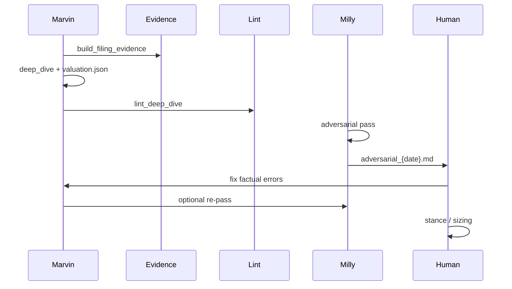

# Proposal: Adversarial truth-seeking pipeline (Milly)

**Date:** 2026-05-28  
**Status:** **Approved 2026-05-28** — Milly mandatory after each deep dive; **Phase 1 pilot complete** (APLD / QDEL / FRMO `adversarial_2026-05-28.md`)  
**Author:** Marvin (draft for human decision)

---

## Problem

Deep dives are stronger with explicit IRR assumptions, but **errors still slip in**:

- A revenue line from a 10-Q mis-copied into the dive
- `valuation.json` and the assumption ledger disagree
- A forensic short report exists and makes **falsifiable** claims we never address

We want **devil’s advocate** discipline without **hole-finding for sport**. The standard is: *would a skeptical expert with the same filings change their mind?*

---

## Recommendation: **Milly as a second agent** (not a Marvin mood)

| Option | Pros | Cons |
|--------|------|------|
| **A. Upgrade Marvin only** | One workflow | Marvin optimizes for completion; weak at attacking own draft |
| **B. Milly second agent** ✓ | Separation of concerns; clear artifact (`adversarial_{date}.md`) | Extra step |
| **C. Human-only review** | Highest judgment | Does not scale across 21 names |

**Choose B.** Keep Marvin as **builder**. Add **Milly** as **auditor** (see `_system/agents/MILLY.md`).

Vicki already exists for **browser / IR** tasks. Milly is **epistemic QA**, not web scraping.

---

## Pipeline (repeatable)

**Gate:** Milly runs **after** lint, **before** human treats dive as final.

---

## What Milly does (three passes)

### Pass 1 — Filing reconciliation

- Read draft deep dive + `filing_digest` + full-tier `_text/` for latest 10-K/10-Q (or local annual).
- Extract **every numeric [Fact]** and table metric.
- Compare to filing; flag mismatches and missing adjustment labels.

### Pass 2 — Internal consistency

- `valuation.json` ↔ assumption ledger ↔ executive summary ↔ returns statement.
- Sum-of-parts lines ↔ payoff.
- Run and extend `lint_deep_dive.py` findings.

### Pass 3 — Short activist scan

- Registry: `_system/frameworks/short_activist_registry.md` (Muddy Waters, Hindenburg, Kerrisdale, Spruce Point, Iceberg, etc.).
- Per ticker: web search + cache under `third-party-analyses/short_reports/`.
- Reconcile **material** claims; do not cite debunked or stale shorts without date context.

**Output verdict is not “short wins.”** It is: *claim X is refuted / valid / unaddressed in our dive.*

---

## What Milly does **not** do

- Replace human stance decisions
- Auto-flip `accumulate` → `watch` because a short exists
- Fabricate controversies
- Duplicate Marvin’s entire research (no second deep dive)

---

## Implementation phases

| Phase | Deliverable | Effort |
|-------|-------------|--------|
| **0** (done) | Rules: `MILLY.md`, `short_activist_registry.md`, this proposal | — |
| **1** | `lint_adversarial.py` + `filing_facts.py` + `lint_deep_dive --milly` | **Done 2026-05-28** |
| **2** | Milly charter + `adversarial_review_template.md` + YAML verdict | **Done** |
| **3** | Pilot: **APLD**, **QDEL**, **FRMO** | **Done** |
| **4** | `short_scan_batch.py` → `short_scan_{date}.md` (21 rows) | **Done** |
| **5** | `Makefile` `research-check` / `milly_repass` / `milly_log.md` | **Done** |
| **6** | Optional: pre-commit hook | If desired |

---

## Marvin rule change (minimal)

Add to `marvin-core.mdc` and `decision_stack.md`:

> After writing `deep_dive_{date}.md`, run or request **Milly adversarial pass**. Link `research/adversarial_{date}.md` in dive header when complete. Resolve **factual errors** before human sign-off.

---

## Success metrics (truth, not negativity)

| Metric | Good sign |
|--------|-----------|
| Factual errors caught pre-human | Trend down over time |
| Short claims **unaddressed** | Listed in Risks, not ignored |
| False alarms | Milly “pass” when human agrees |
| Stance churn | **Low** — only moves on facts or new filings |

---

## Human decisions (2026-05-28 — all yes)

1. **Milly mandatory** after every deep dive — **yes**
2. **Phase 1 pilot** — APLD, QDEL, FRMO — **yes** (run adversarial reports)
3. **Short scan** — Tier 1 firms per `short_activist_registry.md`
4. **Blockers** — **Factual errors** block “final” dive until fixed; inference / bear gaps → [HUMAN REVIEW] only

---

## Related approvals (2026-05-28)

- **QDEL:** McIntyre letter — approved (`mcintyre`)
- **APLD:** PF3 summary + Reiterate BUY PDF — approved (`apld_pf3_summary`, `apld_reiterate_buy`)

See `_system/frameworks/third_party_sources.md`.
