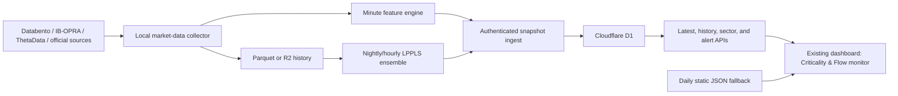

# Criticality & Forced-Flow Monitor

## Objective

Add a real-time market and sector monitor to the existing dashboard that answers three separate questions:

1. **Criticality buildup:** Is price behavior increasingly consistent with an endogenous positive or negative bubble?
2. **Mechanical pressure:** Are volatility-sensitive and other forced sellers likely still increasing their selling?
3. **Exhaustion:** Is that pressure peaking, decelerating, and receiving independent price/liquidity confirmation?

The monitor should support the August 5, 2024 use case without pretending to forecast an exact crash or bottom date. Its initial output is research and decision support—not an automated trading signal.

## Design principle

The Sornette model and the existing capitulation model solve different parts of the problem:

| Layer | Question | Update speed | Primary output |
|---|---|---:|---|
| LPPLS criticality | Is an unstable endogenous regime building? | Nightly, then hourly | Direction, confidence, critical-time window |
| Forced-flow stress | Is mechanical deleveraging accelerating? | 1–5 minutes | Pressure and liquidity scores |
| Exhaustion confirmation | Has forced pressure peaked and begun to fade? | 1–5 minutes | Candidate/confirmed state and reason codes |

Do not combine these into one opaque score. Show the three scores together and use an explicit state machine to describe their interaction.

## What to reproduce from Sornette

The core LPPLS form in the supplied book is:

`log p(t) = A + B(tc - t)^m {1 + C cos[omega log(tc - t) + phi]}`

The dashboard implementation should use the numerically more stable reparameterization described by Filimonov and Sornette, where the linear parameters are solved conditionally and only three nonlinear parameters require numerical search. The model output is an ensemble distribution, not a single fitted curve.

For every asset and horizon:

- Fit many overlapping calibration windows.
- Apply predeclared parameter and oscillation filters.
- Report the fraction of fits that qualify—the LPPLS Confidence Indicator.
- Report the median and 10th/90th percentiles of the implied `tc` values.
- Track fit stability across successive recalibrations.
- Distinguish positive bubbles from negative bubbles.
- Suppress the signal when too few fits converge or the ensemble is too dispersed.

Interpret `tc` as a region where the current regime becomes increasingly unsustainable. It is not a guaranteed crash date. False alarms and smooth regime changes are expected.

## Online precedents

- The [ETH Financial Crisis Observatory](https://emeritus.er.ethz.ch/financial-crisis-observatory.html) is the closest operational precedent: it published positive- and negative-bubble maps as a risk-monitoring cockpit.
- An [FCO Cockpit report](https://ethz.ch/content/dam/ethz/special-interest/mtec/chair-of-entrepreneurial-risks-dam/documents/FCO/FCO_November%202019.pdf) shows the practical multi-window fitting and confidence-indicator presentation.
- [Filimonov and Sornette’s stable calibration paper](https://arxiv.org/abs/1108.0099) supplies the preferred estimation method.
- The [multiscale LPPLS confidence-indicator paper](https://arxiv.org/abs/1804.06261) demonstrates nested windows, qualified-fit fractions, and clustering of critical-time scenarios.
- The [early-warning multi-scale quantile paper](https://www.research-collection.ethz.ch/entities/publication/059ec017-981a-4636-80a4-82034c98e115) is useful for uncertainty bands rather than point estimates.
- The open-source [Boulder Investment Technologies LPPLS package](https://github.com/Boulder-Investment-Technologies/lppls) is suitable as a prototype/reference implementation. Pin its version and validate our implementation independently.
- [Deep LPPLS](https://arxiv.org/abs/2405.12803) is a later research track for faster estimation, not an MVP dependency.

The supplied local source is `C:\Users\drewg\Projects\investing-docs\4806Why_Stock_Markets_Crash_Critical_Events_in_Complex_Financial_Systems_compressed-compressed.pdf`, especially chapters 5, 6, 7, and 9.

## Target universe

### Market layer

- SPY, QQQ, IWM, and DIA
- ES, NQ, and RTY front contracts
- VIX spot and the first four VIX futures
- EWJ and a direct Nikkei 225 series where licensing permits
- Optional global risk context: EFA, EEM, HYG, LQD, UUP, and TLT

### Sector layer

- The 11 Select Sector SPDRs
- Sector breadth calculated from current point-in-time constituents
- Equal-weight sector proxies where available
- Sector ETF-versus-constituent divergence

### Security layer

Initially fit individual stocks only when they are:

- in the existing dashboard book,
- among the largest market/sector risk contributors, or
- promoted by a sector or market alert.

This controls computation and avoids presenting noisy LPPLS fits for hundreds of illiquid securities.

## Data plan

### Live and intraday

Use the best entitled source for each field and preserve its provenance:

| Data | Preferred source | Fallback | Target cadence |
|---|---|---|---:|
| Equity/ETF trades and bars | Databento | delayed provider, clearly labeled | 1 minute |
| ES/NQ/RTY and VIX futures | Databento | Cboe/CME delayed data where permitted | 1 minute |
| SPX/SPXW options and Greeks | Existing IB/OPRA live stack | ThetaData for historical research | 1–5 minutes |
| VIX spot and term structure | Cboe/Databento/IB | official daily close | 1–5 minutes |
| Constituents and sector mapping | maintained point-in-time reference | current holdings file | daily |
| Historical options | ThetaData | none | end of day |

Every record needs:

- `event_time`
- `received_time`
- `source`
- `entitlement_mode` (`live`, `delayed`, `eod`, or `estimated`)
- `quality_state`
- `schema_version`

The UI must show freshness and must never label delayed or end-of-day data as real time.

### Storage

- **Cloudflare D1:** latest compact snapshots, historical score series, state changes, and alerts.
- **R2 or local Parquet:** minute bars, option surfaces, fit ensembles, and backtest artifacts.
- **Existing static JSON:** degraded-mode fallback and reproducible daily snapshot.

Raw quotes and full fit ensembles should not be stored in D1.

## Features

### Criticality features

For each asset and horizon:

- positive- and negative-bubble confidence,
- qualified fits / attempted fits,
- `tc` 10th, median, and 90th percentiles,
- parameter medians and dispersion,
- oscillation count and damping-filter pass rate,
- fit residual distribution,
- confidence persistence,
- parameter and `tc` drift between recalibrations,
- ensemble concentration and invalidation flags.

Use approximately 60, 120, 250, 500, and 750 trading-day windows initially. Final grids must be frozen before the holdout backtest.

### Mechanical pressure features

- 1-, 5-, 15-, 30-, and 60-minute return and realized volatility,
- volatility acceleration and volatility-of-volatility,
- drawdown from session, 20-day, and 252-day highs,
- overnight gap and opening-auction dislocation,
- volume, range, spread, and depth z-scores,
- down-volume and downside-variance shares,
- cross-sectional correlation and dispersion,
- market and sector breadth,
- ETF-versus-constituent divergence,
- futures basis and VIX term-structure slope,
- skew and option-implied tail measures,
- 0DTE gamma/liquidity proxies when quote quality is sufficient,
- estimated volatility-targeting demand.

The volatility-targeting proxy should be reported as a range. A practical first version:

`estimated equity exposure = assumed capital × target volatility / forecast volatility`

Compute the change under several target-volatility and capital scenarios. The result is a mechanical-flow pressure proxy—not a claim to observe fund trades directly.

### Exhaustion features

- deceleration in realized-volatility growth,
- decline in downside volume/range intensity,
- stabilization or improvement in spreads/depth,
- intraday reversal and upper-half close location,
- reclaim of prior interval/session highs,
- improvement in breadth and dispersion,
- ETF/constituent convergence,
- VIX curve stabilization,
- option-skew stabilization,
- time since mechanical-pressure peak,
- confirmation persistence across consecutive intervals.

## State machine

Use hysteresis and minimum dwell times so the dashboard does not flap:

1. **Normal**
2. **Observe** — LPPLS confidence is rising or persistent.
3. **Critical** — confidence is high and the `tc` ensemble is concentrated.
4. **Stress** — mechanical pressure and liquidity stress are elevated.
5. **Exhaustion candidate** — pressure has peaked or decelerated, but confirmation is incomplete.
6. **Confirmed exhaustion** — multiple independent price, breadth, liquidity, and volatility confirmations agree.
7. **Cooldown / invalidated** — alert resolved or model conditions failed.

Transitions must include machine-readable reason codes and the threshold/model version used.

## Dashboard experience

Extend the existing fear/capitulation experience rather than create a separate dashboard.

### Global strip

Add a “Criticality & Flow” strip beside the existing market fear tape:

- positive/negative LPPLS confidence,
- critical-time range,
- forced-flow pressure,
- exhaustion score,
- current state,
- last update and source quality.

### Three-stage rail

Show:

`Criticality buildup → Mechanical pressure → Exhaustion confirmation`

Each stage should display its score, direction, change, and top three reason codes. A user should be able to tell whether the market is:

- structurally unstable but calm,
- undergoing active mechanical selling,
- or stabilizing after the pressure peak.

### Sector heatmap

Rows: 11 sectors plus market indices.

Columns:

- LPPLS direction/confidence,
- `tc` window,
- pressure,
- exhaustion,
- breadth,
- liquidity,
- score change,
- freshness.

Clicking a row opens a detail drawer with:

- price and ensemble LPPLS fits,
- `tc` fan chart,
- confidence history by horizon,
- pressure and pressure-decay history,
- breadth/liquidity panels,
- confirmation checklist,
- alert timeline,
- source and model metadata.

### Alert panel

Alerts should say why they exist:

- “Negative-bubble confidence rose to 72%; 90% of qualified `tc` estimates fall within 18 trading days.”
- “Pressure peaked 24 minutes ago; down-volume and spreads are improving, but breadth confirmation is absent.”
- “Signal suppressed: options quotes are stale and only 8 qualifying LPPLS fits remain.”

Avoid a single “crash/no crash” badge.

## System architecture

The existing SPX 0DTE local status server is a useful deployment pattern, but the new market-risk publisher must be a separate process and payload. It may consume sanitized IB market features; it must not import executor order state or gain trading authority.

GitHub Actions remains appropriate for nightly fits and backtests. It is not sufficiently timely or deterministic for 1–5 minute monitoring.

## Repository changes

### Research and model layer

Add:

- `_system/scripts/criticality/fit_lppls.py`
- `_system/scripts/criticality/lppls_filters.py`
- `_system/scripts/criticality/build_criticality_snapshots.py`
- `_system/scripts/criticality/build_flow_stress.py`
- `_system/scripts/criticality/state_machine.py`
- `_system/scripts/criticality/validate_criticality.py`
- `_system/research/criticality_monitor/model_card.md`
- `_system/research/criticality_monitor/event_catalog.csv`
- `_system/research/criticality_monitor/config/*.yaml`

Keep the current `capitulation-v1` model intact. Extend `_system/scripts/build_technical_signals.py` only to merge the independently versioned outputs into the fallback summary.

### Database

Add `dashboard/cloudflare/migrations/0005_criticality_monitor.sql` with:

- `criticality_snapshots`
- `flow_stress_snapshots`
- `market_risk_alerts`

Suggested keys:

- `(scope, symbol, horizon, as_of, model_version)` for criticality
- `(scope, symbol, as_of, model_version)` for flow
- stable UUID plus state timestamps for alerts

Store a compact JSON payload for explanation fields, but keep primary filter/sort fields as typed columns.

### API

Add:

- `GET /api/v1/market-risk/latest`
- `GET /api/v1/market-risk/history?symbol=SPY&window=30d`
- `GET /api/v1/market-risk/sectors`
- `GET /api/v1/market-risk/alerts`
- `POST /api/v1/market-risk/ingest`

The ingest route requires a service token or signed request, a timestamp/nonce replay guard, payload-size limits, and schema validation.

Start with 30–60 second polling. Add Server-Sent Events only if measurement shows polling is inadequate.

### UI

Add:

- `dashboard/criticality-viz.js`
- a criticality section in `dashboard/index.html`
- styles consistent with `dashboard/technical-viz.js`
- loading, stale, delayed, partial, and unavailable states

Preserve the existing `dashboard/data/technical_summary.json` path as a daily fallback.

### Pipeline

- Extend `_system/scripts/export_dashboard_d1_seed.py` for latest criticality/flow snapshots.
- Add a nightly LPPLS job to `.github/workflows/data-pipeline.yml`.
- Run the intraday collector/publisher on the trading host or another always-on service.
- Add schema, calculation, state-transition, endpoint, and rendering tests.

## Validation protocol

### Point-in-time backtest

Use rolling fits with no revised or future data. Freeze:

- window grid,
- parameter filters,
- confidence thresholds,
- state transitions,
- minimum dwell periods,
- event definitions.

Keep a final untouched holdout set.

### Event catalog

Include market stress and calm controls:

- October 1987
- August 1998
- 2000–2002
- 2008–2009
- May 2010
- August 2011
- August 2015
- February 2018
- March 2020
- 2022 drawdown
- August 5, 2024
- matched non-event periods with similar starting volatility/drawdown

For the August 2024 vignette, preserve overnight timestamps and Japan/U.S. session boundaries. Test whether the model distinguished:

- pre-open peak stress,
- continued U.S. forced selling,
- pressure deceleration,
- confirmation of exhaustion,
- and the subsequent three-week neutral window.

### Benchmarks

Compare against:

- current `capitulation-v1`,
- simple drawdown/realized-volatility/VIX rules,
- HAR-RV or GARCH volatility forecasts,
- a transparent regime model,
- LPPLS alone,
- LPPLS plus forced-flow/exhaustion features.

### Metrics

Primary:

- missed-event rate,
- fraction of time in alarm,
- false-alarm duration,
- lead time,
- precision/recall,
- Brier score and calibration,
- `tc` interval coverage,
- sector-ranking information coefficient,
- state stability and data availability.

Secondary:

- subsequent 1-, 5-, 10-, and 20-day returns and drawdowns,
- beta-overlay outcomes net of explicit implementation costs.

Use Sornette’s error-diagram framing: evaluate missed events against time spent in alarm. Do not select a threshold merely because it maximizes historical P&L.

## Delivery sequence

### Phase 0 — Research specification (2–3 days)

- Reproduce canonical LPPLS fits from published examples.
- Freeze parameter conventions and qualification filters.
- Create the point-in-time event catalog and model card.
- Define source entitlements and historical coverage.

**Exit:** reproducible reference fits and a signed-off data dictionary.

### Phase 1 — Daily research MVP (1–2 weeks)

- Fit daily multi-window LPPLS for market and sector ETFs.
- Generate confidence, `tc` ranges, diagnostics, and static JSON.
- Add the three-stage rail, sector heatmap, and detail view behind a research flag.

**Exit:** dashboard renders reproducible daily signals with complete provenance.

### Phase 2 — Intraday pressure/exhaustion (1–2 weeks)

- Ingest one-minute market, sector, futures, VIX, breadth, and liquidity data.
- Calculate forced-flow and exhaustion features every 1–5 minutes.
- Add D1 snapshots, authenticated ingest, freshness states, and alerts.

**Exit:** stable paper feed for full sessions with restart/replay tests.

### Phase 3 — Options and flow enrichment (1–2 weeks)

- Add SPX/SPXW skew, term structure, gamma/liquidity proxies, and quote-quality gates.
- Integrate the volatility-targeting scenario range.
- Add sector ETF/constituent divergence and breadth.

**Exit:** features survive stale/missing feeds and improve holdout metrics.

### Phase 4 — Shadow validation (minimum 4–8 weeks)

- Record every state and alert without changing positions.
- Review event and false-alarm postmortems weekly.
- Compare against frozen simple baselines.

**Exit:** calibration, availability, and false-alarm thresholds pass predeclared requirements.

### Phase 5 — Decision support

- Enable alert-only use.
- If validated, propose a separate human-approved beta-overlay policy.
- Keep automated exposure changes out of scope until separately specified, backtested, and approved.

## MVP acceptance criteria

- Daily LPPLS results are exactly reproducible from stored inputs/config/model version.
- At least 95% of scheduled intraday snapshots arrive within the freshness target during market hours.
- Delayed, stale, or partial sources are unmistakable in the UI.
- Every alert has reason codes, model version, input freshness, and an audit trail.
- The UI shows ensemble uncertainty and never presents `tc` as a promised crash date.
- Point-in-time validation beats the current capitulation model and simple threshold baselines on predeclared error/calibration metrics, not just P&L.
- No model output can place an order or modify exposure.

## First implementation slice

Build the smallest end-to-end vertical slice:

1. Daily SPY, QQQ, IWM, EWJ, and 11-sector LPPLS ensembles.
2. One `criticality_snapshots` table and `GET /market-risk/latest`.
3. A three-stage dashboard rail populated by daily LPPLS plus the existing `capitulation-v1` pressure/exhaustion scores.
4. A sector heatmap with data-quality and freshness indicators.
5. A point-in-time replay for August 2024 and at least three control periods.

This will expose whether LPPLS adds stable information before spending time on the full real-time data system.
